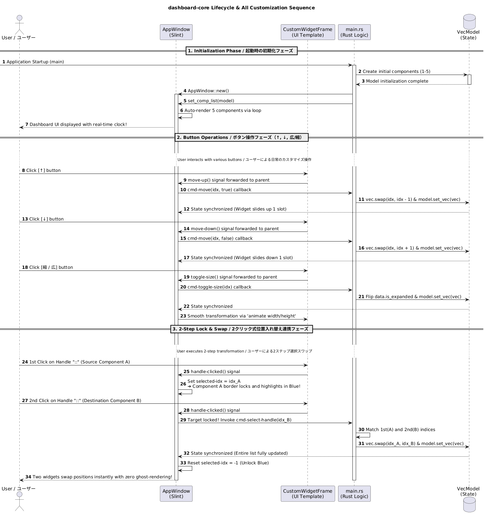

# dashboard-core 🚀
> Variable Object-Type Dynamic Dashboard / 可変オブジェクト型・動的ダッシュボード
[English]  
A dashboard framework built using Rust's safety and Slint's declarative UI, 
[日本語]  
Rustの安全性とSlintの宣言型UIを最大限に活かし、完全なステート駆動型で構築されたダッシュボードフレームワークです。

---

## 👥 Author / 開発者情報
- **Developer**: Kenji Igarashi 👤
- **GitHub**: [://github.com](https://github.com](https://github.com/kenjiigarashi/dashboard-core) 🔗
- **LinkedIn**: [://linkedin.com]([https://www.://linkedin.com](https://www.linkedin.com/in/kenjiigarashi/) 🔗
- **Created**: 2026-06-03

- **EN**: It is completely free for personal use, commercial use, modification, and redistribution. Since it is under the MIT license, please feel free to apply your favorite designs, modify the code, and use it however - - **JA**: 本プロジェクトは **MIT License** のもとで公開されています。個人利用・商用利用・改変・再配布が完全に自由です。MITライセンスにしておりますので、好きなデザイン、改良をしてお使いください！

---

## 📜 10 Design Principles / 10の設計原則

All UI components are unified under a single state management struct (`ComponentState`) and strictly controlled based on the following 10 absolute principles.
全てのUIコンポーネントは、共通の状態管理構造体（`ComponentState`）として構築されたカスタム基盤であり、以下の10の絶対原則に基づいて制御されています。

### 1. State-Driven UI / ステート駆動
- **EN**: UI never manipulates controls directly. The UI strictly synchronizes and follows data (State) changes automatically.
- **JA**: 画面を直接操作せず、データ（State）の変更により画面を自動追従させるモダンな設計を徹底しています。

### 2. Full Clone Overwrite (set_vec) / クローン一括全部入れ替え
- **EN**: Avoids partial data updates entirely. Instead, a clean clone (`Vec`) is safely replicated, modified, and used to replace the entire model via Slint's standard method `set_vec`. This resets the inner rendering history, completely eliminating ghost/duplicate rendering bugs common in dynamic arrays.
- **JA**: 部分的なデータ上書きを完全に排除し、安全に複製した最新クローン（`Vec`）で丸ごと一括置換（全置換）する思想に統一。Slint内部の古い描画履歴を完全にリセットし、動的増減で発生しがちな「残像・分身バグ」を分子レベルで根絶しています。

### 3. Table-Driven Mapping / 関数配列テーブル駆動
- **EN**: Uses a lookup table where the key (`comp-type`) acts as a component index. This eliminates massive `switch-case` statements, guaranteeing infinite extensibility for adding new components later.
- **JA**: 合言葉（`comp-type`）を添え字（インデックス）にしたルックアップテーブル方式を採用。巨大な `switch-case` 文を排除し、6, 7, 8番目の機能への無限の拡張性を担保しています。

### 4. Safe Multi-threading / 堅牢マルチスレッド
- **EN**: Runs a background timer via `std::thread::spawn` to fetch system time. To satisfy Rust's strict ownership laws, it issues a weak reference via `as_weak()` and safely dispatches updates to the main UI thread via `invoke_from_event_loop`, adhering to strict GUI multi-threading rules.
- **JA**: Linuxシステム時計から本物の現在時刻を吸い上げるリアルタイムチクタクタイマーを別スレッドで稼働。`as_weak()` による使い捨て許可証（Weakポインタ）と `invoke_from_event_loop` を介し、GUIマルチスレッドの鉄則を守った安全なスレッド間同期を実現しています。

### 5. 2-Step Lock & Swap / 2クリック式位置スワップ
- **EN**: Click once to lock/highlight the source element, and click another component's handle to instantly swap their positions. This creates a highly reliable position-swap UI that is completely independent of complex OS drag-and-drop quirks.
- **JA**: 「::」ハンドルを1回目で選択（青くロック）➔ 2回目で位置交換。OSや環境のドラッグ＆ドロップ仕様に依存しない、極めて直感的かつ確実な位置入れ替えUIを独自に開発・実装しています。

### 6. Clean Physical Removal / 完全な物理削除
- **EN**: When deleting a component, it physically removes the item from the Rust vector (`vec.remove`) instead of toggling flags. Combined with the auto-shrink layout, the layout collapses gracefully without leaving even a 1-pixel gap.
- **JA**: ✕ボタンを押した瞬間、フラグ管理ではなくRustの配列から要素そのものを物理抹消（`vec.remove`）。透明なコンテナの隙間を1ピクセルすら残さないクリーンなUIを達成しています。

### 7. Sequential Unlocking / 安全な機能追加
- **EN**: New features (Weather, Stock, Todo) are unlocked sequentially by tracking the exact data type of the last element in the array. This prevents indexing errors regardless of item deletions.
- **JA**: 新機能（天気、株価、Todo）の増築は、既存の最後尾のデータ型を正確に追跡して順番に追加。データ件数の増減に惑わされない、データ整合性の高い追加ロジックです。

### 8. Smooth Transitions / 美しいアニメーション
- **EN**: Applies `animate width/height` with an elegant transition duration of 150ms and `ease-in-out` easing, providing a natural, smooth, and tactile user experience.
- **JA**: サイズ変更や並び替えのトリガーに対し、0.15秒の絶妙な緩急（`ease-in-out`）を持たせた `animate width/height` を実装。生き物のような自然な手触りを表現しています。

### 9. Unified State Management / 完全なデータテーブル管理
- **EN**: Centralizes all component states (ID, title, dimensions, component types) into a single, structured `ComponentState` data table.
- **JA**: ダッシュボード上に並ぶ全てのコンポーネントの状態（ID、タイトル、形状、種類）を、`ComponentState` 構造体で一元管理しています。

### 10. Declarative for-loop / 最高のテーブル駆動ループ
- **EN**: Uses Slint’s `for-loop` to map component states directly, nesting children components dynamically via `@children` without bloated layouts.
- **JA**: Slintの `for` ループ内で状態を直接参照し、外枠（`CustomWidgetFrame`）の中に中身（`@children`）を動としてはめ込む、余計な入れ子のない極上の宣言型UI構築を達成しています。

---

## 📊 System Sequence Diagram / 全体シーケンス図

Below is the full sequence diagram covering the entire application lifecycle (from startup to move-up/down, toggle-size, and 2-step swapping).
以下は、起動時の初期化から、日常のボタン操作、そして2クリック式位置入れ替えまでの全ライフサイクル網羅したシーケンス図です。




## ⚠️ [Notice] / ご使用にあたって
- **EN**: The internal logic of each built-in component (Balance, Clock, Date, Stock, etc.) is implemented as a sample mock to demonstrate the framework's behavior. Feel free to swap them out with your own production-grade custom widgets.
- **JA**: 本システム内に初期実装されている各機能（資産残高、時計、日付、経済指標など）の内部ロジックは、フレームワークとしての挙動を検証するためのサンプル（モック）です。用途に合わせて、独自の専門コンポーネントへ自由に入れ替えて拡張するためのテンプレートとしてお使いください。

---

## 🛠️ Tech Stack / 技術スタック
- **Language**: Rust 🦀
- **GUI Engine**: Slint 🏎️

---

## 🚀 Quick Start / クイックスタート

```bash
# 1. Clone the repository / リポジトリのクローン
git clone https://://github.com/dashboard-core.git
cd dashboard-core

# 2. Run the application / アプリケーションの実行
cargo run
```

---

## 📄 License / ライセンス
This project is released under the **MIT License** (Royalty-Free).  
- **EN**: It is completely royalty-free and available for personal or commercial use. Please feel free to apply your favorite designs, modify the code, and improve it however you like! *(Note: This project is built using Slint under the Slint Royalty-Free Desktop License).*
- **JA**: 本プロジェクトは**MITライセンス（ロイヤリティフリー）**のもとで公開されています。使用料は一切かからず、個人・商用問わず自由にお使いいただけます。好きなデザインへの変更や、改良をして自由にお使いください！ *(注意: 本システムは Slint Royalty-Free Desktop License に基づき、Slint を使用して作成いますいますしています)。*

## 💼 Commercial Use & Royalty-Free Policy / 商用利用とロイヤリティフリーについて

[English]  
This framework uses **Slint** as its GUI engine. Under the *Slint Royalty-Free Desktop License*, you can use this framework for commercial applications completely free of charge (Royalty-Free) by choosing one of the following two routes:
1. **Open Source Route (Standard)**: If you publish your application's code under an open-source license (such as MIT or GPL), you can use Slint for free with no royalties.
2. **Closed Source Route (Ambassador)**: If you wish to keep your application's source code private/proprietary for commercial business, you can apply for the free "Slint Ambassador Program" on the official Slint website. This grants you a 100% royalty-free, commercial closed-source license at no cost.
*Note: To comply with Slint's terms, this application includes the mandatory "Built with Slint" attribution text at the bottom of the window.*

[日本語]  
本フレームワークは、GUIエンジンに **Slint** を採用しています。Slintの公式規約（Slint Royalty-Free Desktop License）に基づき、以下のいずれかのルートを選択することで、**商業目的（ビジネス）であっても完全無料（ロイヤリティフリー）**で自社システム等に組み込んで配布・利用することが可能です。
1. **オープンソース・ルート（標準）**: アプリケーションのコードをオープンソース（MITやGPL等）として公開して配布する場合、初期費用・ロイヤリティともに完全無料で利用できます。
2. **クローズドソース・ルート（アンバサダー）**: 企業のビジネス要件等で「ソースコードを非公開（プロプライエタリ）」のまま商用利用したい場合、Slint公式サイトから無料の「Slint Ambassador Program」に登録するだけで、コードを非公開にしたまま、初期費用もロイヤリティも一切かからない商用ライセンスが適用されます。
---


